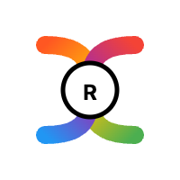

# Logo 生成器

**简介**：用户输入品牌需求，多个大模型各自根据需求绘制 SVG 格式的 Logo 设计，然后让一个大模型做评分员从多个方面对备选作品进行评分，最终选出优胜作品。

**备注**：Dify 的 SVG 渲染效果不佳，如遇渲染出错，可以用 [SVGviewer](https://www.svgviewer.dev/) 预览

**示例：**

| 输入                                                         | 输出                     |
| ------------------------------------------------------------ | ------------------------ |
| 品牌种类：山地车 品牌名称：Rider 风格偏好：充满活力 配色方案：多色 目标受众：运动爱好者 其他说明：null |  |
| 品牌种类：服装 品牌名称：Retro 风格偏好：复古怀旧 配色方案：都可以 目标受众：复古服装爱好者 其他说明：null |  |
| 品牌种类：人工智能扫地机器人公司 品牌名称：null 风格偏好：科技先进 配色方案：单色 目标受众：null 其他说明：null |  |

