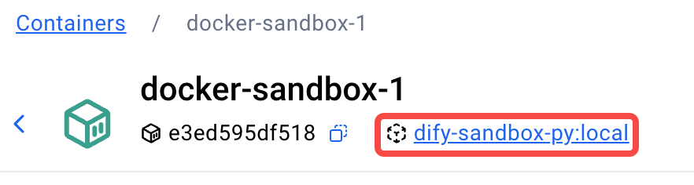
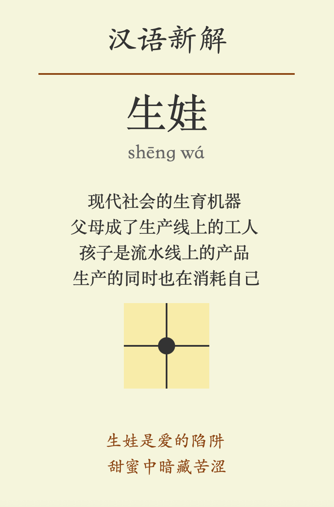
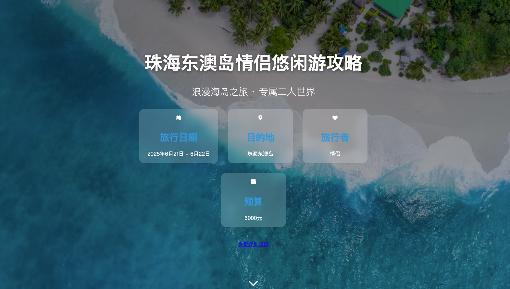
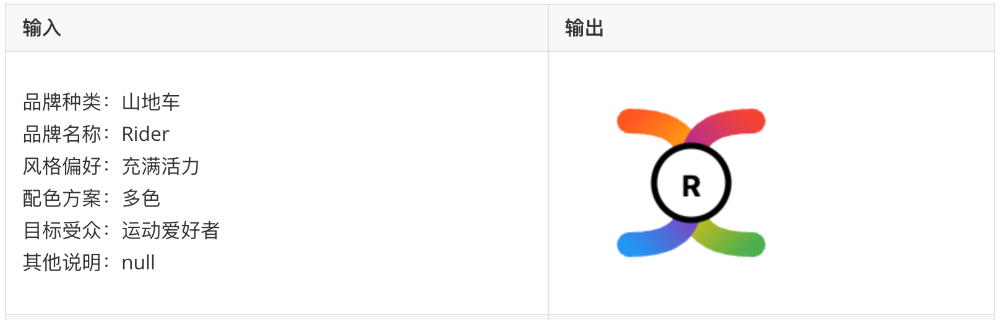
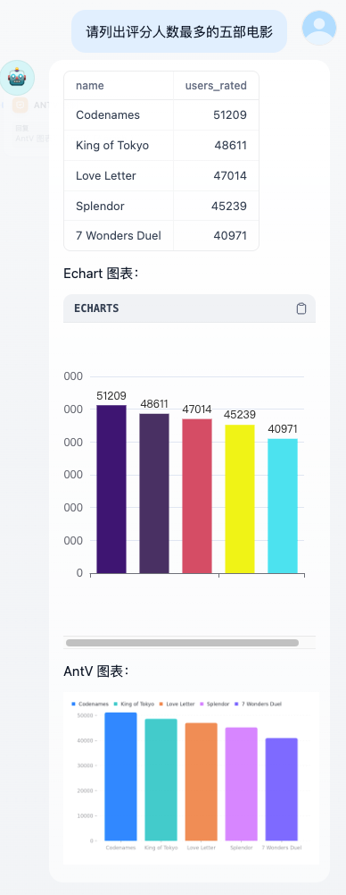

# DifyDSLHub

这是本人闲暇学习并构建的DSL 工作流仓库，有些工作流修改或引用自他人（会注明）。
本仓库供个人使用和学习，请使用 Dify 0.14.0 及以上版本导入。

## 1. Dify Tips

1. Dify 社区版本地部署及更新：

   1. docker compose 部署：[docs.dify](https://docs.dify.ai/zh-hans/getting-started/install-self-hosted/docker-compose)
   2. 更新 Dify：打开 dify 的 docker 文件夹，先备份 volume 文件夹 ➡️ 拉取最新版镜像

   ```shell
   cd dify/docker
   cp -r /volumes ../volumns_history # volumes 包含所有本地数据，更新完确认数据无误再删除备份
   docker compose down
   git pull origin main
   docker compose pull
   docker compose up -d
   ```

2. 在代码模块引入更多的 python 库：

   1. 长期解决方法：修改 sandbox 的 requirements.txt ，重启容器

      1. 打开 `dify/docker/volumes/sandbox/dependencies/python-requirements.txt`添加相关的包，如sympy~=1.13.3
      2. 关闭容器：`docker stop docker-sandbox-1`
      3. 重启容器：`docker compose up -d sandbox`

   2. 迅速解决方法：手动在容器内安装，适合快速测试，但容器重启后修改会丢失

      ```shell
      docker exec -it docker-sandbox-1 /bin/bash
      # 1. 安装相关的包
      pip install tabulate # uv pip install --system tabulate
      # 2. 测试是否安装成功
      python -c "import tabulate; print(tabulate.__version__)"
      # 3. 退出容器
      exit
      ```

3. 使用改良过的 sandbox 容器：

   1. 下载仓库：`https://github.com/svcvit/dify-sandbox-py/`，兼容 python 3.12 和 node.js 20

   2. 打开dify-sandbox-py 文件夹，打包镜像：

      ```shell
      docker build -t dify-sandbox-py:local .
      ```

   3. 打开 `dify/docker/docker-compose.yml`，找到 sandbox: 的配置，做两处修改：

      1. 更改镜像：

         ```yaml
         sandbox:
         # image: langgenius/dify-sandbox:0.2.10
         image: dify-sandbox-py:local
         ```

      2. 在 volume 处挂载本地文件目录

         ```yaml
         volumes:
           - ./volumes/sandbox/dependencies:/dependencies
           - ./volumes/sandbox/conf:/conf
           # 新增：映射用户上传文件目录
           - ./volumes/app/storage/upload_files:/app/api/storage/upload_files  
         ```

   4. 打开`dify/docker`，重启服务

      ```shell
      docker-compose down
      docker-compose up -d
      ```

     5. 确认是否更改镜像成功：打开 docker destop查看

        

   6. 确认本地文件目录是否挂载成功

      ```shell
      docker exec -it docker-sandbox-1 /bin/bash
      ls /app/api/storage
      ```

4. Dify docker 中与其他软件交互：创建共享网络，将两者容器都加入共享网络中，以 firecrawl 为例

   1. 创建共享网络：

      ```shell
      docker network create shared-network
      ```

   2. 查看都有哪些容器

      ```
      docker ps
      ```

   3. 将 dify 容器和 firecrawl 容器加入共享网络

      ```shell
      docker network connect shared-network docker-plugin_daemon-1
      docker network connect shared-network docker-api-1
      docker network connect shared-network docker-worker-1
      docker network connect shared-network firecrawl-api-1
      docker network connect shared-network firecrawl-redis-1
      docker network connect shared-network firecrawl-playwright-service-1
      ```

   4. 授权 firecrawl

      1. url：http://firecrawl-api-1:3002
      2. key：your_difined_key

## 2. DSL更新

### 2025-06-22

| 文件夹       | 简介                                                         | 注释                                                         |
| ------------ | ------------------------------------------------------------ | ------------------------------------------------------------ |
| 汉语新解     | 输入一个汉语词语，LLM以最犀利的口吻来批判这个词，并输出格式化的 SVG 图片。<br /> | 灵感来源：[ClaudePrompt](https://dify101.com/tutorial/hanyuxinjie) |
| 旅游行程规划 | 基于高德 MCP 构建的旅游行程规划工作流，工作流先生成 markdown 文件，再基于 markdown 生成精美的 html 网页。文件夹中有关于MCP 调用的样板工作流供学习。 | 需在市场下载插件： **Agent 策略（支持 MCP 工具）**           |
| Logo 生成器  | 基于用户的品牌需求，多个大模型各自根据需求绘制 SVG 格式的 Logo 设计，然后让一个大模型做评分员从多个方面对备选作品进行评分，最终选出优胜作品。 | 可以按需更改为自己喜欢的大模型                               |
| 表格分析     | 基于用户上传的文档，大模型根据提问生成对应的python 代码，代码提交给 sandbox 执行后返回分析结果，并绘制图表。 | 需要先安装改良过的 sandbox 容器                              |

**输出示例：**

1. 汉语新解：

   

2. 旅游行程规划：

   

3. Logo 生成器：

   

4. 表格分析：

   