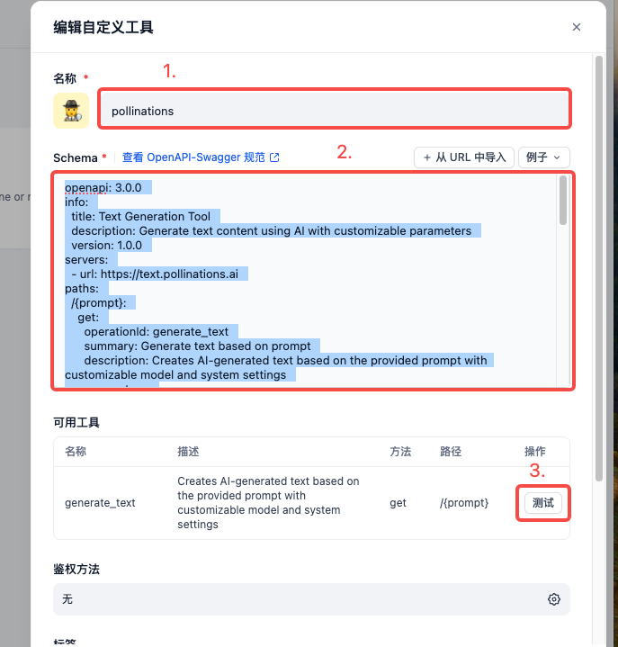
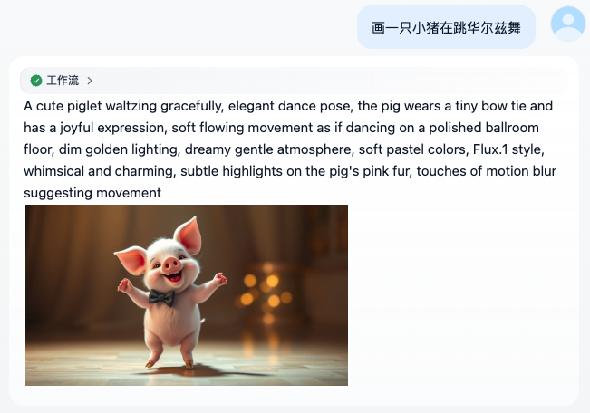
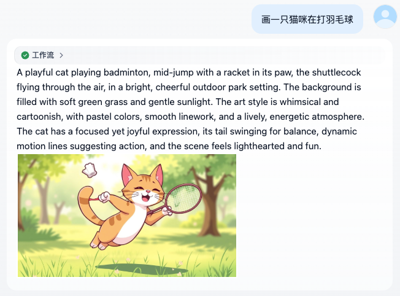

# 免费画师

**背景：**[Pollinations AI](https://github.com/pollinations/pollinations/blob/master/APIDOCS.md) 提供了许多免费且免 key 的模型，用 Get 方法轻松调用，日常学习再也不用心疼钱包啦～

**简介**：本工作流尝试创建自定义工具来调用 Pollinations AI 的文本模型，对用户的输入进行美化，然后再用 HTTP 请求生成最终图片。

**模型**：文本美化 - OpenAI GPT-4.1，图片生成 - Flux

**准备工作**：

1. 配置自定义工具：名字 + json schema，搞定！什么？你问我为啥不直接用 HTTP 调用，问就是我更喜欢自定义工具的界面。为什么图片生成不用自定义工具？因为...... Pollinations 直接返回图片的二进制文件，自定义工具没办法解析后存入文件，但 http 节点提供了（我觉得是 bug......）

   

   ```
   openapi: 3.0.0  
   info:  
     title: Text Generation Tool  
     description: Generate text content using AI with customizable parameters  
     version: 1.0.0  
   servers:  
     - url: https://text.pollinations.ai  
   paths:  
     /{prompt}:  
       get:  
         operationId: generate_text  
         summary: Generate text based on prompt  
         description: Creates AI-generated text based on the provided prompt with customizable model and system settings  
         parameters:  
           - name: prompt  
             in: path  
             required: true  
             description: Text prompt for content generation  
             schema:  
               type: string  
               example: "Write a short poem about robots"  
           - name: model  
             in: query  
             required: false  
             description: AI model to use for generation  
             schema:  
               type: string  
               default: "mistral"  
               enum: ["mistral", "gpt", "claude"]  
               example: "mistral"  
           - name: seed  
             in: query  
             required: false  
             description: Random seed for reproducible results  
             schema:  
               type: integer  
               example: 123  
           - name: system  
             in: query  
             required: false  
             description: System prompt to define AI behavior  
             schema:  
               type: string  
               example: "You are a poet"  
         responses:  
           '200':  
             description: Successfully generated text  
             content:  
               text/plain:  
                 schema:  
                   type: string  
                   example: "Robots dance in silicon dreams..."  
           '400':  
             description: Invalid parameters  
           '500':  
             description: Text generation failed
   ```

2. 导入 DSL 文件：

   

**示例：**





**Pollinations 可调用的文本模型列表**：

```
['deepseek', 'deepseek-reasoning', 'grok', 'llamascout', 'mistral', 'openai', 'openai-audio', 'openai-fast', 'openai-large', 'openai-reasoning', 'openai-roblox', 'phi', 'qwen-coder', 'searchgpt', 'bidara', 'elixposearch', 'evil', 'hypnosis-tracy', 'midijourney', 'mirexa', 'rtist', 'sur', 'unity']
```

| Name               | Description                                  | Provider         | Tier      | Community | Input Modalities   | Output Modalities | Tools | Vision | Audio |
| ------------------ | -------------------------------------------- | ---------------- | --------- | --------- | ------------------ | ----------------- | ----- | ------ | ----- |
| deepseek           | DeepSeek V3                                  | azure            | seed      | False     | text               | text              | False | False  | False |
| deepseek-reasoning | DeepSeek R1 0528                             | azure            | seed      | False     | text               | text              | False | False  | False |
| grok               | ==xAI Grok-3 Mini==                          | azure            | seed      | False     | text               | text              | True  | False  | False |
| llamascout         | Llama 4 Scout 17B                            | cloudflare       | anonymous | False     | text               | text              | False | False  | False |
| mistral            | Mistral Small 3.1 24B                        | cloudflare       | anonymous | False     | text, image        | text              | True  | True   | False |
| openai             | OpenAI GPT-4.1 Mini                          | azure            | anonymous | False     | text, image        | text              | True  | True   | False |
| openai-audio       | OpenAI GPT-4o Audio Preview                  | azure            | anonymous | False     | text, image, audio | audio, text       | True  | True   | True  |
| openai-fast        | OpenAI GPT-4.1 Nano                          | azure            | anonymous | False     | text, image        | text              | True  | True   | False |
| ==openai-large==   | ==OpenAI GPT-4.1==                           | azure            | anonymous | False     | text, image        | text              | True  | True   | False |
| openai-reasoning   | ==OpenAI O3 (provided by chatwithmono.xyz)== | chatwithmono.xyz | anonymous | False     | text, image        | text              | -     | True   | False |
| openai-roblox      | OpenAI GPT-4.1 Mini (Roblox)                 | azure            | seed      | False     | text, image        | text              | True  | True   | False |
| phi                | Phi-4 Mini Instruct                          | azure            | anonymous | False     | text, image, audio | text              | False | True   | True  |
| qwen-coder         | Qwen 2.5 Coder 32B                           | scaleway         | anonymous | False     | text               | text              | True  | False  | False |
| searchgpt          | OpenAI GPT-4o Mini Search Preview            | chatwithmono.xyz | anonymous | False     | text               | text              | True  | False  | False |
| bidara             | BIDARA (Biomimetic Designer by NASA)         | azure            | anonymous | True      | text, image        | text              | True  | True   | False |
| elixposearch       | Elixpo Search                                | scaleway         | seed      | True      | text               | text              | False | False  | False |
| evil               | Evil                                         | cloudflare       | seed      | True      | text, image        | text              | True  | True   | False |
| hypnosis-tracy     | Hypnosis Tracy                               | azure            | seed      | True      | text, audio        | audio, text       | True  | False  | True  |
| midijourney        | MIDIjourney                                  | azure            | anonymous | True      | text               | text              | True  | False  | False |
| mirexa             | Mirexa AI Companion                          | azure            | anonymous | True      | text, image        | text              | True  | True   | False |
| rtist              | Rtist                                        | azure            | anonymous | True      | text               | text              | True  | False  | False |
| sur                | Sur AI Assistant                             | cloudflare       | seed      | True      | text, image        | text              | True  | True   | False |
| unity              | Unity Unrestricted Agent                     | cloudflare       | seed      | True      | text, image        | text              | True  | True   | False |

**Pollinations 可调用的生图模型列表：**

```
["flux","turbo","gptimage"]
```

