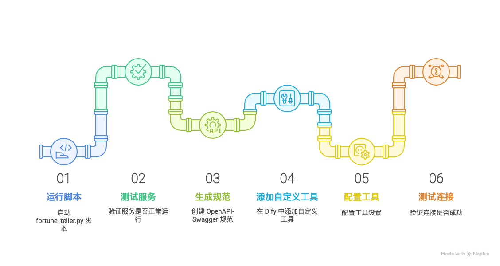
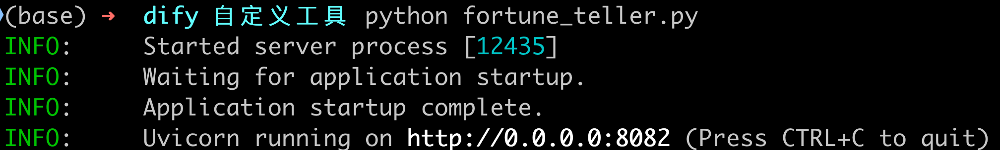
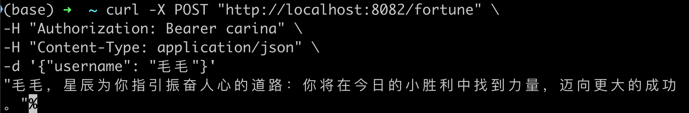
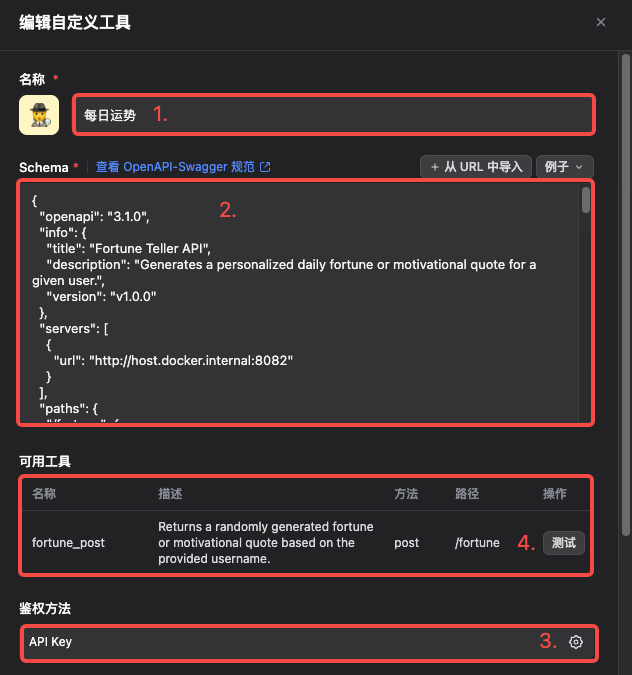
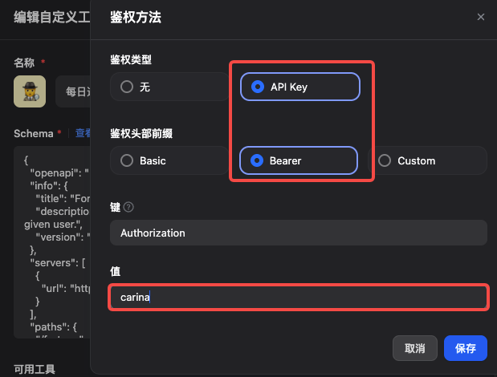
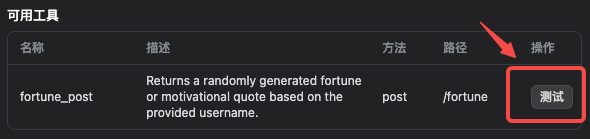
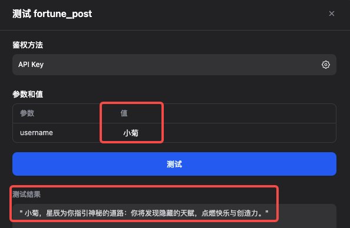

# dify 自定义工具添加示例



1. 运行 `fortune_teller.py`

   ```
   python fortune_teller.py
   ```

   

2. 打开另一个命令行，测试服务是否正常

   ```
   curl -X POST "http://localhost:8082/fortune" \
   -H "Authorization: Bearer carina" \
   -H "Content-Type: application/json" \
   -d '{"username": "毛毛"}'
   ```

   

3. 生成OpenAPI-Swagger规范：

   1. 可以让万能的大模型帮我们写，输出保存到 `openai_fortune.json` 以备后续使用

      ```markdown
      请把curl请求命令转成openapi 3.1.0 版本的json schema
      
      <curl>
      curl -X POST "http://localhost:8082/fortune" \
      -H "Authorization: Bearer carina" \
      -H "Content-Type: application/json" \
      -d '{"username": "毛毛"}'
      </curl>
      
      <json-schema>示例：
      {
            "openapi": "3.1.0",
            "info": {
              "title": "Get weather data",
              "description": "Retrieves current weather data for a location.",
              "version": "v1.0.0"
            },
            "servers": [
              {
                "url": "https://weather.example.com"
              }
            ],
            "paths": {
              "/location": {
                "get": {
                  "description": "Get temperature for a specific location",
                  "operationId": "GetCurrentWeather",
                  "parameters": [
                    {
                      "name": "location",
                      "in": "query",
                      "description": "The city and state to retrieve the weather for",
                      "required": true,
                      "schema": {
                        "type": "string"
                      }
                    }
                  ],
                  "deprecated": false
                }
              }
            },
            "components": {
              "schemas": {}
            }
          }
      </json-schema>
      ```

   2. 注意：url 要设置为`http://host.docker.internal:8082`，而不是`http://localhost:8082`或``http://127.0.0.1:8082``

      1. 因为在容器内部，`localhost` 或 `127.0.0.1` 指向的是容器自身的网络接口，而不是宿主机的网络接口。因此，当 Dify 容器尝试访问 `http://localhost:8082`，它实际上试图连接到容器自身的 `127.0.0.1:8082`，而容器内并没有运行任何服务监听该端口，导致连接失败。
      2. `host.docker.internal` 是 Docker Desktop 提供的一个特殊 DNS 名称，专门用于让容器访问宿主机的网络接口，允许容器直接访问宿主机上运行的服务。

4. 在 Dify 的工具界面点击添加自定义工具，依次填写

   

   

5. 配置完成，测试连接是否成功

   

   
