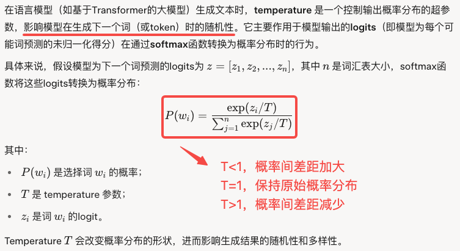
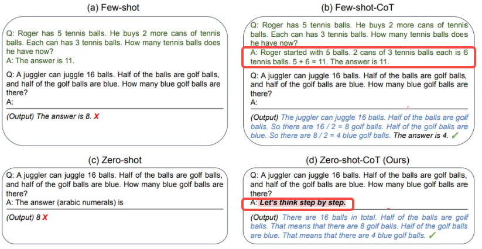
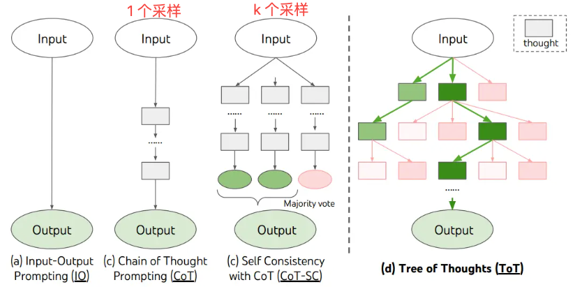
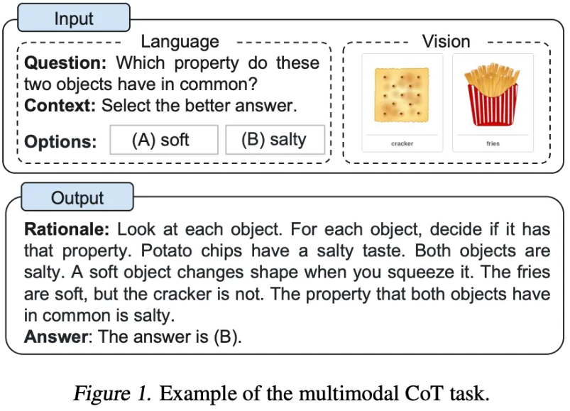
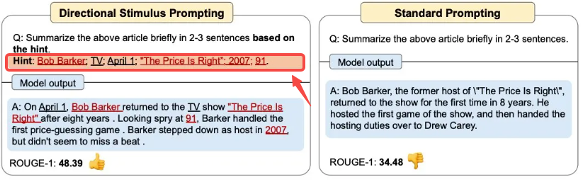
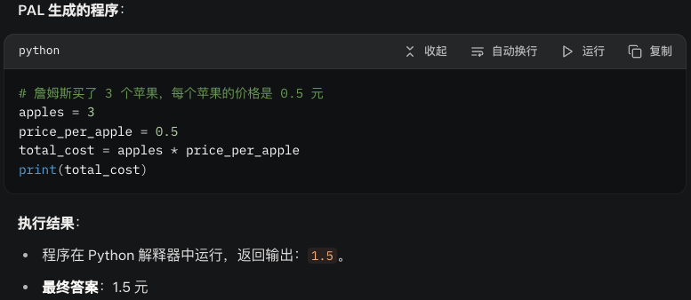
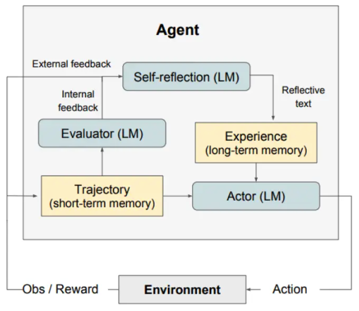

本笔记为本人学习[PromptEngineeringGuide](https://www.promptingguide.ai/introduction)时撰写，笔记里加入了许多本人感兴趣的扩展知识。

# 1. 简介

## 1.1. LLM 模型参数

> 1. 生成结果多样性控制：Temperature & top-p & top-k、Frequency Penalty & Presence Penalty
> 2. 生成结果长度控制：Max Length、Stop Sequences

1. 生成结果多样性的作用：

   1. 结果更随机 ➡️ 可能会带来更多样化或更具创造性的产出，eg：诗歌创作等创造性任务
   2. 结果更确定 ➡️ 促使模型基于事实返回更真实简洁的结果，eg：事实核查等质量核查任务。质量核查任务（quality assurance, QA）可能包括以下场景：
      1. **问答系统**：模型需根据给定的上下文或知识库，准确回答用户的问题，要求答案基于事实，简洁且无歧义。例如，基于文档的问答（Document-based QA）或知识库问答（Knowledge-based QA）。
      2. **数据验证**：在数据处理流程中，模型可能被用来验证数据的准确性、一致性或完整性，例如检查生成内容的正确性或是否符合预定义规则。
      3. **自动化测试**：模型生成测试用例、验证代码输出或检查用户界面中的文本是否符合预期。
      4. **内容审核**：模型用于检查生成内容的质量，例如确保文本没有语法错误、逻辑错误或偏离事实。

2. 生成结果长度控制的作用：

   1. 控制输出长度：避免生成过长或无关的内容
   2. 格式化输出：确保生成的内容在特定点结束，例如在生成 JSON 时遇到 `}`
   3. 任务特定需求：在对话、代码生成或问答任务中，停止生成以匹配预期格式

3. **Temperature**：`temperature` 的参数值越小，模型就会返回越确定的一个结果。

   1. 技术原理：对 softmax 函数的 logits 进行修改

      

   2. 生效条件：T 的作用依赖于解码策略 decoding strategy，如果解码策略为：贪婪解码（Greedy Decoding），即：总是选择概率最高的词，则更改 T 起不了任何作用。但实际应用中。大模型一般采用的是**随机采样或top-k/top-p 采样**，这使得 temperature 的作用变得显著。常用解码策略：

      1. 随机采样（Random Sampling）：根据概率分布随机抽样一个词

      2. Top-k 采样（Top-k Sampling）：从概率最高的前 k 个词中按概率进行随机抽样，eg：
         $$
         z = [5,4,3,2,1], \, k = 3, \, T= 2\\
         \downarrow \\
         P = [0.399, 0.294, 0.216,0.159, 0.117]\\
         \text{前 3 个词归一化后的概率：} \\
         \downarrow \\
         P' = [0.439, 0.323, 0.238]
         $$

      3. Top-p 采样（Nucleus Sampling）：从累积概率达到 p 的最小词集合中按概率进行随机抽样

   3. 起类似作用的参数：**top-k**、**top-p**

2. **Max Length**：控制大模型生成的 token 数，防止大模型生成冗长或不相关的响应并控制成本。
3. **Stop Sequences**：一组预定义的字符串（或 token 序列），当模型在生成过程中输出这些序列时，生成过程会立即终止。
   1. 技术原理：在生成每个 token 后，检查当前生成的 token 序列是否匹配预定义的 stop sequence。如果匹配，立即停止生成。
   2. 使用 Stop Sequences 的例子：
      1. `11` 作为 `stop sequence` 来告诉模型生成不超过 10 个项的列表
      2. `\n}` 作为 `stop sequence` 来告诉模型生成一个 JSON 对象，停止在对象闭合时

4. **Frequency Penalty**：通过给重复数量多的 Token 设置更高的惩罚来减少响应中单词的重复。
   1. 技术原理：修改模型预测的 token 概率分布，基于生成历史中每个 token 出现的频率，动态降低已出现 token 的概率，通常通过直接调整 logits 来实现
   2. 起类似作用的参数：**Presence Penalty**，但与 `frequency penalty` 不同的是，惩罚对于所有重复 token 都是相同的。出现两次的 token 和出现 10 次的 token 会受到相同的惩罚。

## 1.2. Prompt 基本概念

1. prompt 的角色：`system`、`user` 和 `assistant`，system 不是必须的

2. prompt 可以包含以下任意要素：
   1. **指令**：想要模型执行的特定任务或指令。
   2. **上下文**：包含外部信息或额外的上下文信息，引导语言模型更好地响应。
   3. **输入数据**：用户输入的内容或问题。
   4. **输出指示**：指定输出的类型或格式。
   5. **样本**：展示给模型的示例

3. 设计 prompt 的通用技巧：

   1. 从简单开始，将任务分解为更简单的子任务，并随着结果的改善逐步迭代

   2. 具体说明你希望模型执行的指令和任务，但应注意提示的长度

   3. 避免不明确的描述，直接并具体说明

      ```markdown
      解释提示工程的概念。保持解释简短，只有几句话，不要过于描述。❌
      使用 2-3 句话向高中学生解释提示工程的概念。✅
      ```

   4. 避免说不要做什么，而应该说要做什么

      ```markdown
      以下是向客户推荐电影的代理程序。代理负责从全球热门电影中推荐电影。它应该避免询问用户的偏好并避免询问个人信息。如果代理没有电影推荐，它应该回答“抱歉，今天找不到电影推荐。”。
      ```顾客：请根据我的兴趣推荐一部电影。
      客服：
      ```

# 2. 提示技术

> 简单任务技术：zero-shot、few-shot、CoT、self-consistency、GKP、multimodal CoT
>
> 复杂任务技术：meta prompting、prompt chaining、ToT、RAG
>
> 高级任务技术：ART、APE、Active-Prompt、Directional Stimulus Prompting、PAL、ReAct、Reflexion、

## 2.1. 简单任务技术

1. zero-shot：不需要向模型提供任何示例

2. Few-shot：提供示例对解决某些任务很有用。当 few-shot 不起作用时，意味着模型通过示例学到的东西不足以在任务上表现良好，需要尝试更多的提示技术。

3. Chain-of-Thought 提示：链式思考（CoT）提示通过中间推理步骤实现了复杂的推理能力。CoT与少样本提示相结合可以在推理任务中表现良好。

   1. zero-shot CoT：`Let's think step by step.`、`让我们逐步思考`
   2. few-shot CoT：

   

   3. [Auto-CoT](https://github.com/amazon-science/auto-cot)：使用自动生成的示例加CoT触发词：`Let's think step by step`
      1. **问题聚类**：将给定问题划分为几个聚类
      2. **演示抽样**：从每组数组中选择具有代表性的问题，使用带有简单启发式的 Zero-Shot-CoT 生成示例
      3. **推理应用**：将生成的示例与"Let's think step by step"触发词结合

4. self-consistency：$k$ 次 CoT 采样并选择最常见的答案

   1. 核心思想：通过多次采样模型的输出（即生成多个可能的 CoT 答案），然后选择最一致（most consistent）或最常见的答案作为最终结果

   2. 适用任务：需要深层推理或存在多种解法可能性的任务，如数学问题、逻辑推理或开放性问答

   3. 工作步骤：

      1. **生成多条推理路径**：通过提示要求模型使用 CoT 风格的推理，生成问题的分步解决方案。重复此过程k 次（通常 5-40 次），每次采样可能产生不同的推理路径或最终答案
      2. **聚合答案**：收集所有生成的最终答案，统计每个答案的出现频率。通常选择出现次数最多的答案（即“多数投票”）作为最终结果

   4. 举例说明：

      ```markdown
      请一步一步解决：如果一本书的价格是 20 元，打八折后是多少元？展示你的推理过程。重复此过程 5 次，生成 5 条独立的推理路径和答案。然后统计最终答案的频率，选择出现最多的答案作为最终结果。
      ```

5. Generated Knowledge Prompting：GKP，生成知识提示，旨在通过让大模型首先生成与任务相关的背景知识或上下文信息，然后利用这些生成的知识来回答问题或完成任务。

   1. 核心思想：利用模型自身存储的知识，显式地生成中间信息，提高回答的准确性和逻辑性

   2. 和 RAG 的区别：RAG 依赖外部知识库检索信息，而 GKP 完全依赖模型内部知识

   3. 工作步骤：

      1. **生成知识**：通过提示要求模型生成与任务相关的背景信息
      2. **利用知识**：将生成的知识作为上下文，模型基于这些信息回答问题或完成任务
      3. **整合输出**：模型结合生成的知识和任务要求，生成最终答案

   4. 举例说明：

      ```markdown
      我要回答“为什么企鹅不会飞？”请按照以下步骤完成：
      1. 生成关于企鹅的背景知识，包括它们的物理特征、生活环境和进化历史。
      2. 基于生成的知识，解释为什么企鹅无法飞行，结合生物学和进化论的视角。
      3. 提供简洁的最终答案。
      ```

## 2.2. 复杂任务技术

1. Meta Prompting：指导大模型处理复杂任务时，通过分解问题、生成中间步骤或自我反思来提高输出质量

   1. 核心思想：强调**任务分解和多阶段引导**

   2. 常见步骤：

      1. 让模型先列出解决问题的步骤，再逐一执行。
      2. 要求模型在回答后检查自己的输出，找出潜在错误。
      3. 引导模型模拟多角色视角（例如，专家、批评者）来优化答案。

   3. 举例说明：

      ```markdown
      我要写一篇 200 字的短文，主题是“人工智能对教育的影响”。请按照以下步骤完成：
      1. 列出写作计划：包括引言、正文（至少两个主要论点）、结论的结构。
      2. 为每个部分提供简要的要点（每部分 1-2 句话）。
      3. 根据计划和要点，撰写完整的短文，字数控制在 180-220 字。
      4. 检查短文是否逻辑清晰、语言流畅，并进行必要的优化。
      请按顺序完成每一步，展示中间过程。
      ```

2. Prompt Chaining：LLM 可能无法仅用一个非常详细的提示完成复杂的大任务。在 Prompt Chaining 中，LLM 根据提示执行一个子任务，直到完成大任务的需求。

   1. 核心思想：创建多个提示来让大模型按步骤执行

   2. 举例说明：根据大型文本文档回答问题，可以设计两个不同的提示

      1. prompt 1：负责提取相关引文以回答问题

         ```markdown
         你是一个很有帮助的助手。你的任务是根据文档回答问题。第一步是从文档中提取与问题相关的引文，由####分隔。请使用<quotes></quotes>输出引文列表。如果没有找到相关引文，请回应“未找到相关引文！”。
         
         ####
         {{文档}}
         ####
         ```

      2. prompt 2：以引文和原始文档为输入来回答给定的问题

         ```markdown
         根据从文档中提取的相关引文（由<quotes></quotes>分隔）和原始文档（由####分隔），请构建对问题的回答。请确保答案准确、语气友好且有帮助。
         ####
         {{文档}}
         ####
         <quotes>
         {{引文}}
         </quotes>
         ```

3. Tree of Thoughts：ToT，思维树提示法，引入了树状搜索结构，允许模型探索多个推理路径、评估中间结果并进行前瞻或回溯，从而实现更深思熟虑的决策过程。

   1. 核心理念：通过搜索算法探索推理树，允许模型进行全局决策，而不是局限于局部的、线性的推理路径

      1. 搜索策略：深度优先（DFS）/广度优先（BFS）/集束（beam）搜索、强化学习

      2. 和CoT 、CoT-SC相比：

         

   2. 适用场景：24点游戏、求解方程、决策分析、创意写作

   3. 工作流程：

      1. **问题定义**：明确任务目标和输入
      2. **思想生成**：从当前状态生成多个可能的“思想”（中间推理步骤）。这些思想可以是假设、子问题解决方案或部分推理
      3. **思想评估**：使用模型自身或外部评估机制（如价值函数或启发式规则）对每个思想的质量打分，判断其对解决问题的贡献
      4. **搜索控制**：根据评估结果选择 k 个最优思想继续扩展，或回溯到之前的节点重新探索其他路径
      5. **迭代与终止**：重复生成和评估，直到找到满足任务目标的方案或达到搜索限制（如最大深度或时间）

   4. [ToT 提示词](https://github.com/dave1010/tree-of-thought-prompting)：

      ```
      Imagine three different experts are answering this question.
      All experts will write down 1 step of their thinking,
      then share it with the group.
      Then all experts will go on to the next step, etc.
      If any expert realises they're wrong at any point then they leave.
      The question is...
      
      假设三位不同的专家来回答这个问题。
      所有专家都写下他们思考这个问题的第一个步骤，然后与大家分享。
      然后，所有专家都写下他们思考的下一个步骤并分享。
      以此类推，直到所有专家写完他们思考的所有步骤。
      只要大家发现有专家的步骤出错了，就让这位专家离开。
      问题是...
      ```

4. 检索增强生成：Retrieval-Augmented Generation (RAG) ，输入并检索出一组相关的文档，这些文档作为上下文和输入的原始提示词组合，送给文本生成器得到最终的输出

   1. 核心思想：从外部获取额外信息辅助模型生成内容

   2. 核心步骤： ==信息检索 + 后检索处理 + 生成==

      1. 检索：检索器通常基于向量相似度搜索或关键字匹配，从数据库中返回一组与查询（query）相关的候选文档。检索阶段可以优化的部分有：
         1. **文档块大小(Document Chunk Size)**：较小的文档块可以提高信息检索的精确度，但可能丢失上下文；较大的块提供更多上下文，但可能包含不相关信息
         2. **向量模型(Embedding Models)**：选择或微调一个高效的嵌入模型，以生成高质量的向量表示，从而提高检索的准确性和速度。如：通用嵌入模型可能无法区分“苹果（水果）”和“苹果（公司）”的语义
      2. 后检索处理：检索完成后，对检索器返回的文档块（chunks）进行二次加工的过程。通常包括以下 4个核心子步骤：
         1. **信息过滤（Information Filtering）**：从初始检索结果中移除低相关性低的文档块，方法：
            1. **阈值过滤**：示例：只保留相似度 > 0.8 的文档块
            2. **关键词匹配**：检查文档块是否包含查询中的关键术语，过滤掉仅通过向量相似度匹配但语义无关的块
            3. **语义检查**：使用小型语言模型（如 BERT）对文档块进行二次语义分析，剔除与查询语义不符的块。
         2. **信息压缩 (Information Compression) **：对文档块进行精简，缩短上下文长度，同时保留核心语义。方法：
            1. **摘要提取**：使用生成模型（如 BART、T5）对每个文档块生成简短摘要，仅保留与查询相关的核心内容
            2. **句子选择**：基于句子级别的相关性评分（如与查询的嵌入相似度），选择文档块中最相关的句子
            3. **去重处理**：识别语义重复的文档块或句子，合并或删除冗余内容
            4. **关键词提取**：提取文档块中的关键术语或短语，替换冗长的叙述
         3. **结果重排 (Result Rerank) **：重新排序检索到的文档块，确保最相关的内容优先提供给生成模型。方法：
            1. **基于模型的重排**：使用专门排序模型对查询和文档块对进行细粒度相关性评分，重新排序
            2. **混合排序**：结合多种信号（如向量相似度、关键词密度、文档元数据）进行综合排序。
            3. **上下文感知重排**：考虑文档块之间的语义连贯性，优先选择能形成完整上下文的块。
            4. **用户意图分析**：根据查询的意图（例如，寻求定义、步骤或比较）调整排序逻辑
         4. **上下文增强 (Context Enhancement)**：在保留检索结果的基础上，添加额外信息或格式化上下文，以提高生成模型的理解能力，方法：
            1. **元数据注入**：将文档的元数据（如标题、作者、日期）添加到检索结果中，提供更多背景
            2. **查询扩展**：将查询改写或扩展为更具体的形式，重新评估文档块的相关性
            3. **结构化输出**：将检索结果组织为结构化格式（如列表、表格），便于生成模型处理

   3. 举例说明：使用 Json 文件里的信息来生成感谢信

      ```markdown
      Given the following wedding guest data, write a very short 3-sentences thank you letter:
      
      {
        "name": "John Doe",
        "relationship": "Bride's cousin",
        "hometown": "New York, NY",
        "fun_fact": "Climbed Mount Everest in 2020",
        "attending_with": "Sophia Smith",
        "bride_groom_name": "Tom and Mary"
      }
      
      Use only the data provided in the JSON object above.
      
      The senders of the letter is the bride and groom, Tom and Mary.
      ```

5. multimodal CoT：多模态思维链提示方法，将文本和视觉融入到一个两阶段框架中。第一步涉及基于多模态信息的理性生成。接下来是第二阶段的 CoT 推断

   


## 2.3. 高级任务技术

1. ART：Automatic Reasoning and Tool-use，自动推理并使用工具

   1. 工作原理：

      1. 接到一个新任务的时候，从任务库中选择多步推理和使用工具的示范
      2. 在测试中，调用外部工具时，先暂停生成，将工具输出整合后继续接着生成

   2. 关键步骤：

      1. **任务理解**：模型分析输入任务，识别目标和约束条件。
      2. **推理与规划**：通过逻辑推理（如 Chain-of-Thought 或 Tree-of-Thoughts），分解任务为子任务，制定解决计划。
      3. **工具识别**：根据任务需求，模型选择合适的工具（如计算器用于数学、搜索引擎用于实时信息、代码执行器用于编程）。
      4. **工具调用**：模型生成工具的调用指令（如 API 请求、代码片段），并获取工具返回的结果。
      5. **结果整合**：将工具输出与模型的推理结合，生成最终答案。
      6. **验证与迭代**：模型评估答案的正确性，必要时重新推理或调用其他工具。

   3. 实现技术：

      1. **提示工程**：设计提示引导模型进行推理和工具选择。
      2. **工具集成**：通过 API 或 MCP 使模型与外部工具交互。
      3. **动态调整**：模型根据工具反馈动态优化推理路径。
      4. **上下文管理**：处理长上下文，确保推理和工具调用的一致性。

   4. 举例说明：

      ```markdown
      我要查询 2025 年 6 月 23 日日本东京的天气预报，并分析是否适合户外活动。请按照以下步骤完成：
      
      1. 推理任务需求：确定查询实时天气需要哪些信息（如温度、降雨概率），以及户外活动的标准（如温度 15-30°C，无雨）。
      2. 选择工具：如天气 API（OpenWeatherMap）或搜索引擎获取最新预报。
      3. 调用工具：生成 API 请求或搜索查询，获取天气数据。
      4. 分析数据：根据天气信息评估是否适合户外活动，考虑温度、降雨、风速等。
      5. 验证结果：如果可能，交叉验证多个数据源（如不同天气 API）。
      6. 输出最终分析和建议。
      ```

2. APE：Automatic Prompt Engineer，让模型自动生成、优化或选择高效的 prompt

   1. 核心思想：利用模型自身的生成和评估能力，自动探索和优化 prompt，取代人工手动设计 prompt的繁琐过程。APE 将 prompt design 问题转化为一个优化问题，自动生成多样化的 prompt candidates，评估其效果，并迭代优化，最终找到最适合任务的 prompt

   2. 关键步骤：

      1. **初始化提示集**：人工设计的初始提示或随机生成的提示或通过模型生成一组多样化的提示候选
      2. **提示生成**：使用语言模型生成新的提示变体，通常通过自然语言指令（如“改写这个提示，使语言模型能准确回答数学推理问题，确保提示清晰且包含分步推理要求。”）
      3. **提示评估**：基于任务性能（如准确率、F1 分数）或代理指标（如生成答案的质量）打分
      4. **提示优化**：通过迭代生成和评估，保留高性能提示，剔除低效提示，可能结合搜索算法（如 beam search、遗传算法）或强化学习优化提示空间。
      5. **最终选择**：选择得分最高的提示，或将多个高性能提示组合为最终提示，用于任务执行。

   3. 举例说明：

      ```markdown
      我要优化一个提示，使语言模型能准确解决以下数学问题：“一家商店的商品打八折后售价为 64 元，原价是多少？” 请按照以下步骤完成：
      
      1. 生成三种不同的提示变体，鼓励分步推理，包含不同表述或结构。
      2. 评估每个提示的性能：使用模型回答问题，检查答案正确性（预期：80 元）和推理清晰度。
      3. 选择得分最高的提示，或基于评估结果生成改进提示。
      4. 迭代优化：生成新提示，重复评估，直到性能稳定。
      5. 输出最终优化提示和答案。
      ```

3. Active-Prompt：利用模型的反馈或不确定性度量，从一个示例池中主动选择最有代表性或最有信息量的 CoT 示例，从而提高模型的推理能力

   1. **核心思想**：不依赖于人工挑选示例，而是通过算法自动选择与任务高度相关的示例

   2. **关键步骤**：

      1. **准备示例池**：从任务相关的数据集中收集一组带标注的示例（通常是人工标注的 input-output对）
      2. **不确定性评估**：使用模型对示例池中的每个示例进行预测，计算其不确定性（如答案的熵或置信度分布），识别哪些示例对模型最“困难”或最有信息量。不确定性度量方法：
         1. **熵（Entropy）**：计算模型预测答案的概率分布熵，熵越高表示模型对该示例的不确定性越大。
         2. **置信度差（Margin Sampling）**：选择模型在 top-2 预测答案之间置信度差最小的示例。
         3. **最大分歧（Maximum Disagreement）**：多次采样模型输出，选择答案分布最不一致的示例。
      3. **示例选择**：基于不确定性度量，主动选择一小部分（ 1-10 个）最有代表性的示例。
      4. **提示构造**：将选中的示例与任务描述和输入查询结合，生成完整的提示，引导模型进行推理。
      5. **推理与验证**：模型基于优化后的提示生成答案，并可通过多次采样或验证进一步提高准确性。
      6. **迭代优化（可选）**：根据模型性能反馈，重新评估和更新示例选择，动态优化提示。

   3. 举例说明：

      ```markdown
      我要解决逻辑谜题：“如果今天是星期三，两天后是星期几？” 请按照以下步骤完成：
      
      1. 从以下示例池中选择 2 个最有信息量的示例（基于不确定性评估）：
        * 示例 1：如果今天是星期一，三天后是星期几？（答案：星期四，解答：1 + 3 = 4）
        * 示例 2：如果今天是星期五，一天后是星期几？（答案：星期六，解答：5 + 1 = 6）
        * 示例 3：如果今天是星期二，四天后是星期几？（答案：星期六，解答：2 + 4 = 6）
        * 示例 4：如果今天是星期日，两天后是星期几？（答案：星期二，解答：7 + 2 = 9 mod 7 = 2）
        
      2. 不确定性评估：对每个示例运行模型预测，计算答案熵，选择熵最高的 2 个示例。
      3. 构造提示：使用选中的 2 个示例和 CoT 风格，引导模型分步推理。
      4. 解决目标问题，验证答案（预期：星期五）。
      5. 输出最终提示和答案。
      ```


4. Directional Stimulus Prompting：方向性刺激提示策略。通过训练并优化一个小型的策略 LM 来生成提示，用来指导 LLM 的生成。

   1. 核心思想：策略 LM 给出有方向的提示，刺激 LLM 按照预期路径生成内容

   2. 工作步骤：策略模型优化方式有：SFT、RL

      1. **输入实例**：用户提供一个输入（如一段文本或问题）。
      2. **策略模型生成刺激提示**：小型策略模型（例如 T5）根据输入生成一个方向性刺激提示。这个提示是一个短文本，引导大语言模型生成特定输出，如关键词、格式要求或推理步骤等。
      3. **大语言模型生成输出**：将输入和刺激提示一起输入黑盒大语言模型，生成最终输出。
      4. **优化策略模型**：
         1. **监督微调**：使用标注数据集训练策略模型，使其生成更有效的刺激提示。
         2. **强化学习**：通过定义奖励函数，优化策略模型以生成更符合目标的刺激提示。

   3. 举例说明：

      

5. PAL：Program-Aided Language models，程序辅助语言模型，与 COT 不同，它不是使用自由形式文本来推理并获得解决方案，而是将解决步骤加载到编程中

   1. 核心思想：让 LLM 生成可执行程序（如 Python 代码）作为中间推理步骤，并将实际计算任务交给外部运行时环境（如 Python 解释器）来完成，从而提升模型在数学、符号推理和算法任务中的表现

   2. 重点创新：LLM不直接生成最终答案，而是生成一个程序，程序交由外部运行时环境执行

   3. 工作步骤：

      1. **输入**：用户提供一个自然语言问题（如数学问题或符号推理任务）
      2. **程序生成**：语言模型（例如 Codex）生成一个程序（如 Python 代码），描述解决问题的步骤。
      3. **程序执行**：将生成的程序输入外部运行时环境，执行计算并返回结果。
      4. **输出**：将运行时返回的结果作为最终答案。

   4. 适用场景：结构化任务，如数学、算法

   5. 举例说明：==为以下问题生成一个 Python 程序，计算并返回答案：==

      ```markdown
      为以下问题生成一个 Python 程序，计算并返回答案：
      詹姆斯买了 3 个苹果，每个苹果的价格是 0.5 元。他总共需要支付多少钱？
      ```

      

6. ReAct：Reasoning + Acting，让语言模型在推理的同时生成行动（actions），并根据外部环境的反馈（observation）更新推理过程，从而实现更强大的任务解决能力

   1. 核心思想：**推理（Reasoning）和行动（Acting）**交织进行，解决 CoT 存在事实幻觉的问题

   2. 工作步骤：

      1. **输入任务**：用户提供一个自然语言任务描述（如回答问题、完成网页导航）。

      2. **生成轨迹（Trajectory）**：模型生成包含推理（Thought）、行动（Action）和观察（Observation）的序列。示例：

         ```markdown
         Thought: 我需要查找问题的答案，先搜索相关信息。
         Action: search[问题关键词]
         Observation: 搜索结果包含以下内容：[...]
         Thought: 根据搜索结果，答案可能是 X，但需要确认。
         Action: lookup[X]
         Observation: X 的定义是 [...]
         Thought: 确认答案为 X。
         Answer: X
         ```

      3. **外部交互**：行动由外部环境执行（如搜索引擎、知识库、交互式网页），返回观察结果。
      4. **任务完成**：模型根据推理和观察生成最终答案。

   3. 适用场景：知识密集型问答、事实性检查、交互式决策

   4. 举例说明：

      ```markdown
      为以下任务生成 Thought-Action-Observation 序列，完成购买：
      购买一瓶容量至少 500ml 的洗发水，价格不超过 10 美元。
      ```

      ```markdown
      Thought: 我需要搜索符合条件的洗发水，容量 ≥ 500ml 且价格 ≤ 10 美元。
      Action: search[shampoo 500ml under $10]
      Observation: 搜索结果显示：
      1. Brand A 500ml 洗发水，价格 $8.99
      2. Brand B 600ml 洗发水，价格 $12.00
      Thought: Brand A 满足条件，我需要查看商品详情。
      Action: 查看[Brand A 500ml shampoo]
      Observation: 商品页面确认：Brand A，500ml，$8.99，库存充足。
      Thought: 商品符合要求，可以购买。
      Action: 购买[Brand A 500ml shampoo]
      Observation: 购买成功，订单已确认。
      Answer: 任务完成，购买了 Brand A 500ml 洗发水，价格 $8.99。
      ```

7. Reflexion：自我反思，通过让模型在每次尝试后对自己的行为或输出进行反思，生成语言化的反馈（verbal feedback），并将这些反馈融入后续尝试，从而迭代优化性能

   1. 核心思想：模拟人类的试错和反思过程，在任务中失败后分析错误原因并调整策略

   2. 核心组件：

      1. Actor：参与者在环境中采取行动，从而形成轨迹，CoT 和 ReAct 被用作参与者模型
      2. evaluator：评估者对参与者的输出进行评价，将生成的轨迹（也被称作短期记忆）作为输入并输出奖励分数
      3. self-reflection：生成语言强化线索/经验来帮助参与者实现自我完善

      

   3. 工作步骤：
      1. **初始尝试（Trial）**：Actor 模型根据任务描述生成初始输出
      2. **外部反馈（External Feedback）**：
         1. 任务环境提供反馈，指示初始尝试的结果（如正确/错误、任务是否完成）。
         2. 反馈可以是二元的（如“成功/失败”）、定量的（如分数）或描述性的（如错误信息）。
      3. **自我反思（Self-Reflection）**：
         1. self-reflection 模型分析初始尝试的结果，结合外部反馈，生成语言化的反思
         2. 反思内容包括：识别错误或失败的原因、总结经验教训、提出改进策略。
         3. 反思以自然语言形式存储在长期记忆中，供后续使用。
      4. **记忆与迭代（Memory and Iteration）**：
         1. Actor 模型将反思结果存储为上下文（context），在下次尝试中利用这些反馈优化输出或行动
         2. 通过多次迭代（trial-reflection-iteration），模型逐步改进，直到任务成功或达到最大尝试次数
