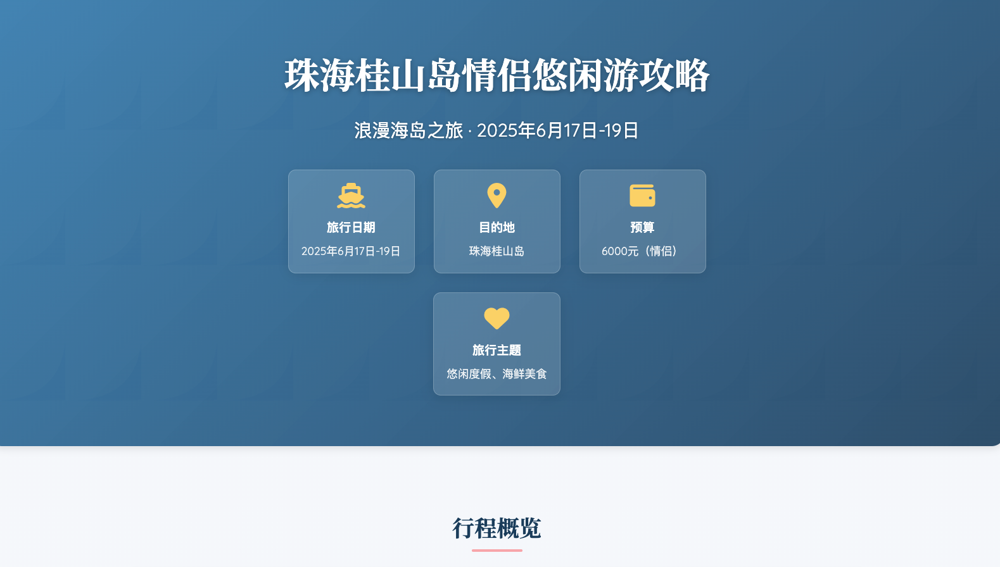
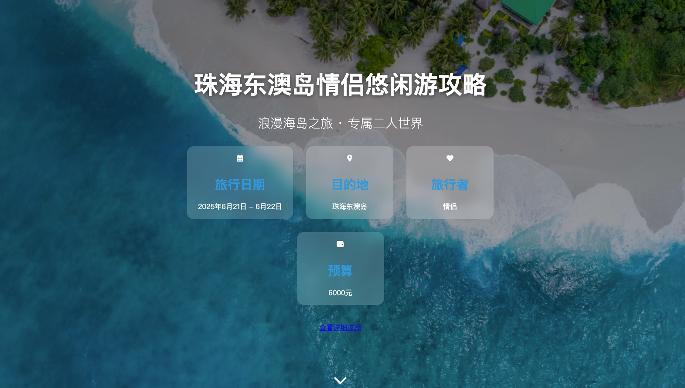
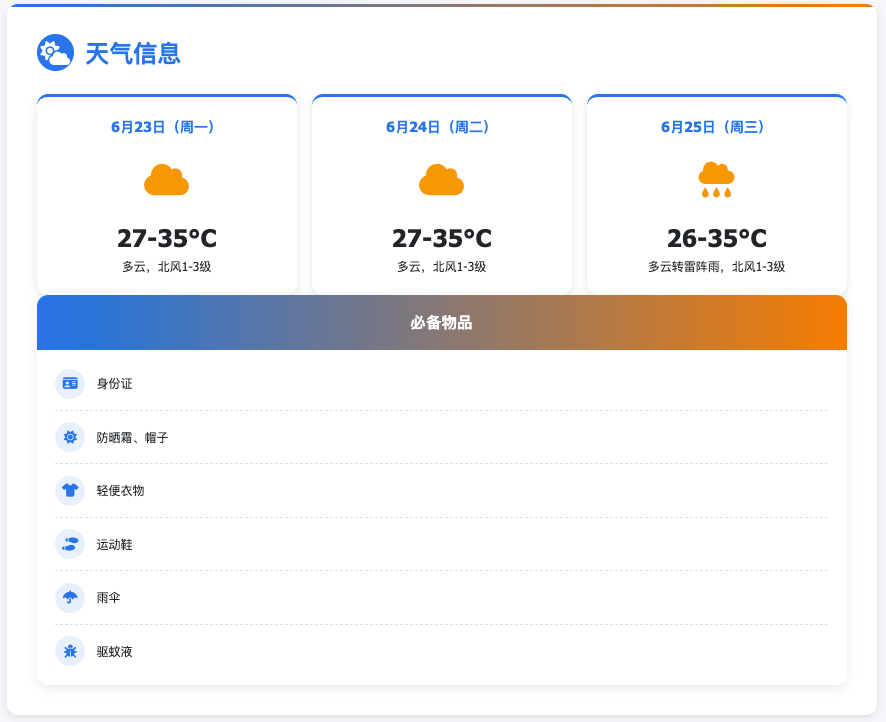

# 旅游行程规划

**简介**：基于高德 MCP 构建的旅游行程规划工作流，该工作流先生成 markdown 文件，再基于 markdown 生成精美的 html 网页。

**高德 MCP 工具学习**：[高德 MCP](./MCP 调用学习/README.md)

**示例：**

1. 我从深圳出发，去珠海桂山岛玩，坐船去。 我打算6月 17日出发，玩 3 天。 预算 6 千，小情侣玩。 我希望悠闲一点，主要想多吃美食。 

   

2. 我从深圳出发，去珠海东澳岛玩，坐船去。 我打算6月 21日出发，玩 2 天。 预算 6 千，小情侣玩。 我希望悠闲一点，主要想多吃美食。

   

3. 我从深圳出发，去佛山玩，自驾游。 我打算6月23日出发，玩 3 天。 预算 2 万，家庭出游，有 2 老 4 大 2 小。 我希望悠闲一点，主要想多吃美食。 

   
