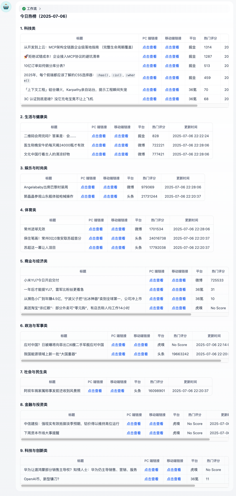
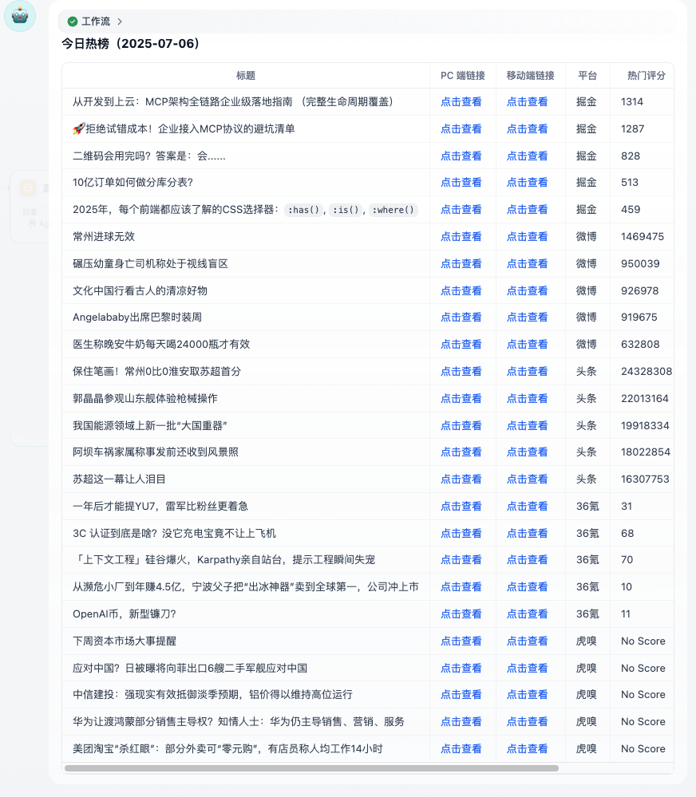

# 每日热点新闻

**简介**：本工作流基于 Rookie RSS 调用 https://hot.imsyy.top/ 的新闻热榜数据，收集了虎嗅、微博、掘金、头条、36氪等 5 个网站的数据并整理成 markdown 表格。用户可以选择直接输出 markdown表格，也可以让大模型调用 JINA AI 工具查看各个文章后进行新闻分类。

**亮点**：

1. 如果无需新闻分类，我们可以不费任何大模型 token，轻松使用代码节点输出结构化的热点新闻表格
2. 如果我们希望进行新闻分类，也可以让大模型帮忙查看文章内容并执行分类输出

**输出示例**：

1. 大模型分类后的输出：

   

2. 直接输出 markdown 表格：

   

