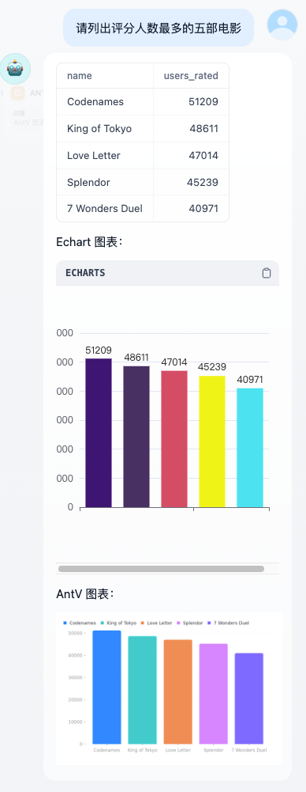

# 表格分析

**简介**：用户上传文档，大模型根据提问生成对应的python 代码，代码提交给 sandbox 执行后返回分析结果。分析结果包括表格和图表。在图表绘制方面，本工作流仅仅是抛砖引玉，以柱状图为例，展示了如何使用 AntV 和 Echart绘制图表。生产环境中，可由大模型作出判断是否绘制图表、绘制哪种类型图表，并调用相关工具或代码。

**声明**：`runLLMcode.yml` 引用自 [svcvit](https://github.com/svcvit/Awesome-Dify-Workflow/blob/main/DSL/runLLMCode.yml)

**准备工作：**

1. 使用改良过的 sandbox 容器：详细安装步骤见[仓库总文档](../README.md)
2. 添加依赖库：dify-sandbox-py 文件夹修改 requirements.txt，添加 `tabulate`。关于如何引入更多的 python 库，详见[仓库总文档](../README.md)
3. 将 `runLLMcode.yml` 发布为工具

**示例：**

