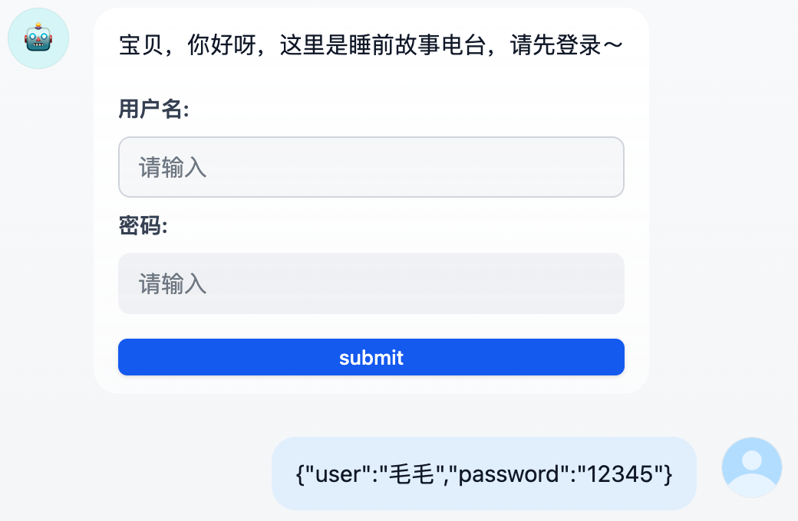
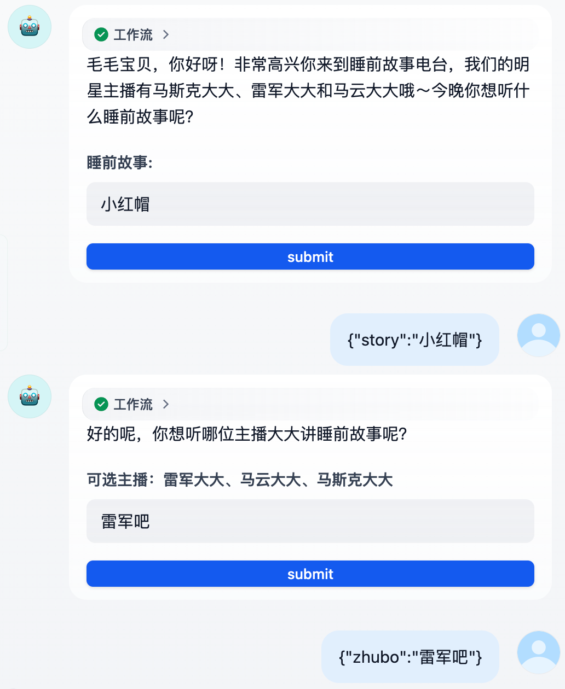
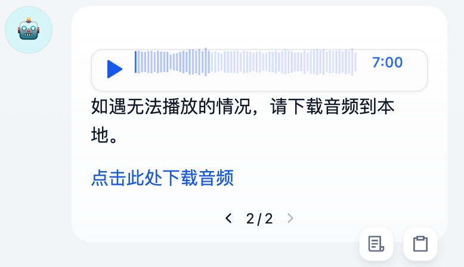
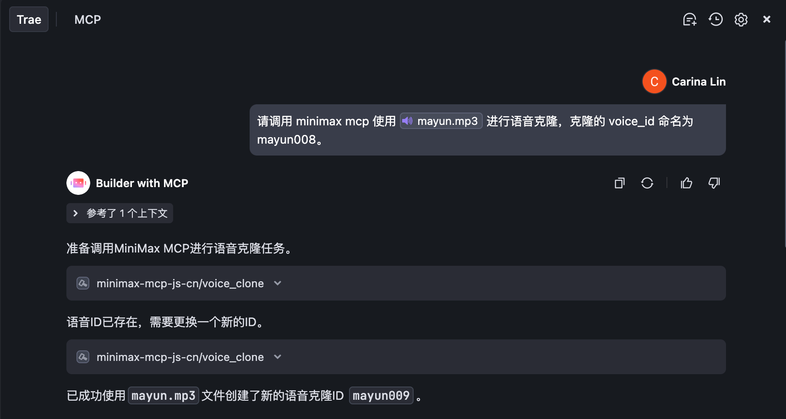
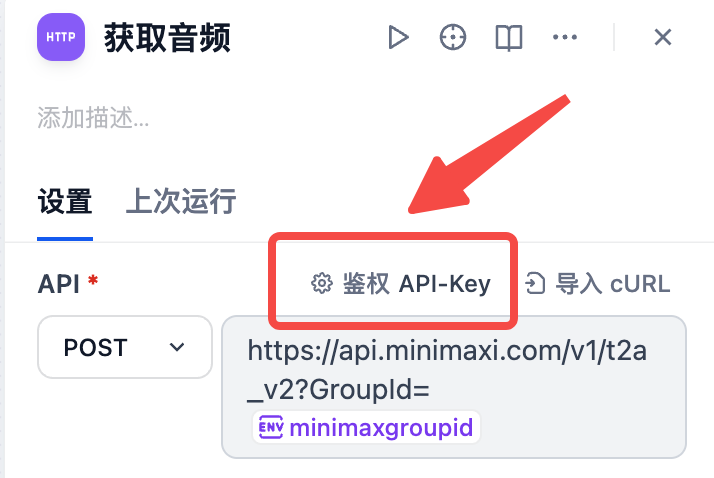

# 雷军讲睡前故事

**简介**：我基于 html form 和 minimax api 构建了一个睡前电台聊天流。该聊天流首先模拟用户登录，接着用 html form 收集用户信息，包括想听的故事和指定的主播。我的电台主播有雷军大大、马斯克大大和马云大大，你可以根据自己的喜好克隆音色并使用。聊天流最后会返回故事音频供播放，也提供了下载按钮。

**亮点**：

1. 使用 html form 模拟用户登录：

   

2. 使用 html form 结构化收集用户信息： html form 的好处是后面可以使用参数提取节点或代码块节点轻松提取对应信息。该聊天流使用的是参数提取节点（因为我想试试这个节点～），不过用代码块更方便，还不费 token。

   

3. 直接调用 minimax api 生成相应音频并输出：使用 api 而不是 mcp 的好处就是不需要让大模型动手呀！

   

**准备工作：**

1. 注册并申请智谱 AI 的 api：[智谱 AI](https://www.bigmodel.cn/login?)

2. 注册并申请 minimax mcp 的 api，主页查看 groupid：[MINIMAX](https://platform.minimaxi.com/)

3. 用 cursor / trae / cline 配置 minimax mcp：[MINIMAX MCP]()

4. 让cursor / trae / cline 使用 `音色克隆` 文件夹里的 mp3 调用 minimax 克隆，这里不建议自己调用 api 进行语音克隆，因为需要：1. 通过Flie接口上传文件 2. 将得到的file_id 进行复刻，比较麻烦，还是 mcp 省心。我这里将 voice_id 分别命名为 `leijun01`、`mayun009`、`musk009_voice`。你可以根据自己喜好克隆音色和命名，不要需要更改工作流的相关节点

   

**注意：**

http 请求节点的鉴权信息不是填在 Header 里，而是点击鉴权按钮进行填写。

